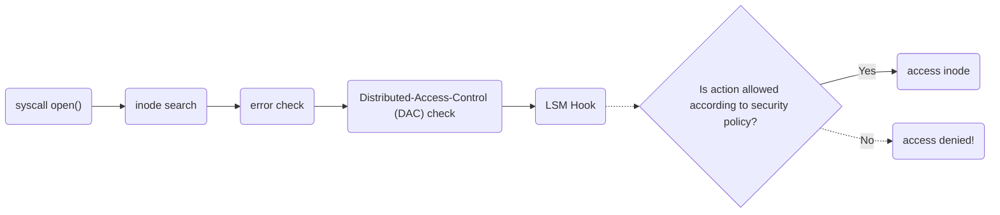

# Introduction

> LSM stands for **Linux Security Module**

To understand its value, first we need to contextualize **where** an LSM[^1] acts in the Linux operating system.
Below is a diagram [^2] of what happens when the System Call to [`open()`](https://man7.org/linux/man-pages/man2/open.2.html) happens:

As we can extrapolate from the diagram, the LSM interface is very simplistic, a context is provided to the LSM and a boolean determiniation on whether to proceed or not should be returned.

LSMs are broken down into two types _major_ and _minor_, you may load multiple _minor_ LSMs but only 1 _major_, they're (_mostly_) non-stackable.
SELinux (the subject of this course) is a _major_ LSM.

## Popular LSM Implementations

### Major

* SELinux (Security-Enhanced Linux) — Devised by the USA's National Security Agency (NSA), then toward the late 2000s maintained and promoted by RedHat Enterprise Linux (RHEL).
* [AppArmor](https://wiki.ubuntu.com/AppArmor) — Mandatory-Access-Control (MAC) system devised by [Immunix](https://en.wikipedia.org/wiki/Immunix) then later integrated into Ubuntu and SUSE Linux distributions,
* [Smack](http://schaufler-ca.com/) (Simplified Mandatory Access Control Kernel) — MAC system that is mostly in use with Samsung's [Tizen](https://www.tizen.org/about) OS.
* [TOMOYO](https://tomoyo.osdn.jp/)/[AKARI](https://akari.osdn.jp/) — MAC system sponsored by NTT Data corporation, from my usage of it I find it has many conceptual similarities with SELinux.

### Minor

* [LoadPin](https://lwn.net/Articles/682302/) — Stackable LSM that the only code from read-only storage can be loaded into the Kernel. This was devised by Google and is leveraged by ChromeOS.
* [Yama](https://www.kernel.org/doc/html/latest/admin-guide/LSM/Yama.html) — Primary focus is to constrain what users can _process trace_ ([ptrace](https://man7.org/linux/man-pages/man2/ptrace.2.html)) into another process' memory.

## Why not use "LSM xyz" instead?

* AppArmor: It's a one way membrane, it may restrict things from escaping, but it does not prevent things from getting into its sandboxes.
* TOMOYO/AKARI: Likely the most comparable in capabilities to SELinux, a concern would be that there is no popular Linux distribution backing its usage.
* Smack: The controversial comment upon its inception was that this could be implemented as an SELinux policy, hence perhaps if you're interested in that you should be interested in SELinux too.

[^1]: More LSM information can be found here https://www.kernel.org/doc/html/latest/admin-guide/LSM/index.html
[^2]: Diagram extracted from this excellent talk from 2019 Embedded Linux Conference called "[Inside the Linux Security Module (LSM)](https://elinux.org/images/0/0a/ELC_Inside_LSM.pdf)", strongly recommended if you wish to go deeper on the internals of how an LSM is invoked.