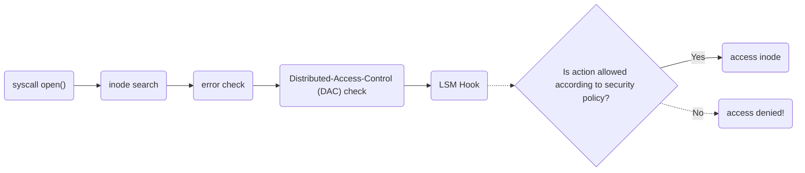

# Introduction

> LSM stands for **Linux Security Module**

To understand it's value, first we need to contextualize **where** an LSM acts in the Linux operating system.
Below is a diagram [^1] of what happens when the System Call to [`open()`](https://man7.org/linux/man-pages/man2/open.2.html) happens:

As we can extrapolate from the diagram, the LSM interface is very simplistic, a context is provided to the LSM and a boolean determiniation on whether to proceed or not should be returned.

LSMs are broken down into two types _major_ and _minor_, you may load multiple _minor_ LSMs but only 1 _major_, they're non-stackable.
SELinux (the subject of this course) is a _major_ LSM.

# Popular LSM Implementations

# Why not use _"x"_ instead?

[^1]: Diagram extracted from this excellent talk from 2019 Embedded Linux Conference called "[Inside the Linux Security Module (LSM)](https://elinux.org/images/0/0a/ELC_Inside_LSM.pdf)", strongly recommended if you wish to go deeper on the internals of how an LSM is invoked.