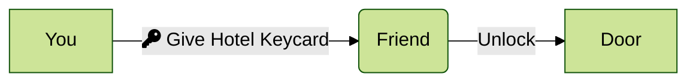
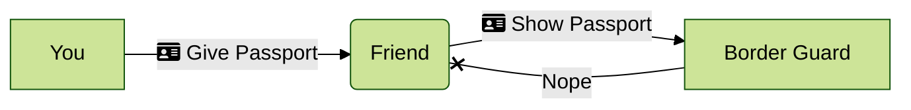

_A fundamental concept in most LSMs is that they usually use Mandatory Access Control.     
I'm still searching for the perfect analogy, to simplify the distinction but I'll give it a shot!_

### Discretionary Access Control (DAC)

Imagine you're staying at a hotel, you get given a non-descript white, plastic key card. If you give this to a friend of yours they can also access the hotel room without any contest. This is DAC (Discretionary Access Control), i.e. it is at the discretion of the holder of the access, who else they can give it to.

DAC is far more common in most operating systems, though it's less secure it's much lower friction for end users to delegate the permission sharing responsibility to an entity that currently has that permission.

### Mandatory Access Control (MAC)

Now the MAC (Mandatory Access Control) version of this is: Imagine that this same friend of yours wants to cross an international border. You give them your passport, can they just simply cross the border using that document?

In the case of SELinux the SELinux code running in Linux Kernel space will be acting as the Border Guard, and it will check a `type`, `class`, `domain` against what action (usually a [syscall](https://en.wikipedia.org/wiki/System_call)) it is attempting to do, and police what is allowed.