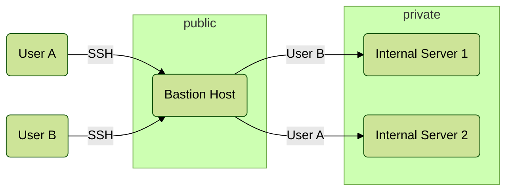

## Context

A _Jump Server_[^1] or _Bastion Host_[^2] in security networking terminology is a heavily secured endpoint that will allow authorized users to connect on to a wider, private network. The term _Bastion Host_ comes from medieval castles.

## Threat Model

It is common for non-public infrastructure to be weakly-authenticated (e.g. username and passphrase), you would SSH (**S**ecure **SH**ell Protocol) connect into a Bastion Host and then connect from there onward to the less-hardened hosts.

If we assume that there is nothing meaningful of interest to an attacker on the Bastion Host **and** that the credentials for each user's Internal Server is unique to them, then the only remaining risk to address is how one user can safely transmit those credentials through the Bastion without the other user being able to read them or use them to authenticate on their behalf.

[^1]: [Jump Server](https://en.wikipedia.org/wiki/Jump_server)
[^2]: [Bastion Host](https://en.wikipedia.org/wiki/Bastion_host)
