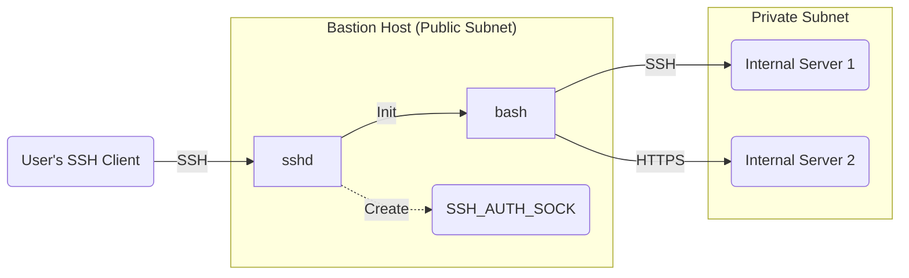

## Listing the necessary functions in the Bastion

1. An inbound TCP connection on port 22 (or whatever the Bastion is using for SSH, this is just the default) needs to be allowed.
2. An outbound TCP connection on some ephemeral port range needs to be made to the private network (we don't care what protocol is used).
3. Our sshd (SSH Daemon) needs to be able to create a `SSH_AUTH_SOCK` file in `/tmp/ssh/...` without other processes being able to snoop on it (No matter if they're root or not!).
4. We otherwise don't really want tenants "exploring" around the Bastion host (fortunately with SELinux policy it's default-deny, so if we don't specify those they don't get them).

## Diagram of what this looks like

